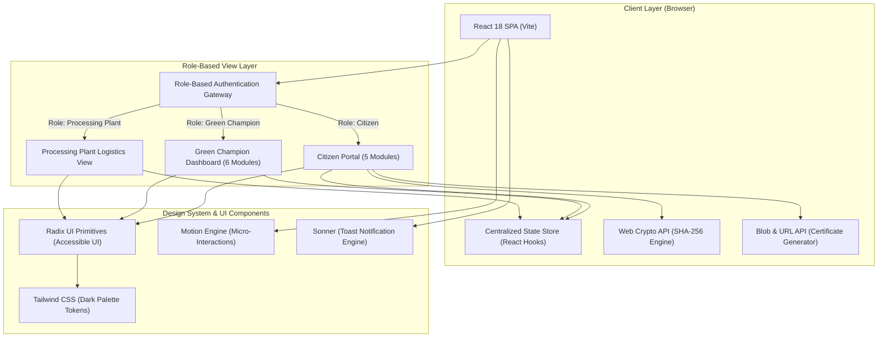
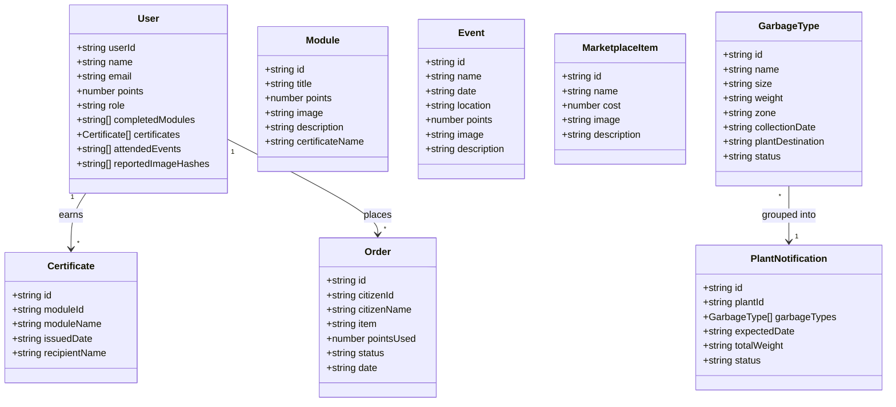

# Eco-Sustain Platform: Complete Technical & Functional Specification

**Project**: Eco-Sustain 
---

## 1. Executive Summary

**Eco-Sustain** is an integrated civic-tech web platform designed to resolve urban solid waste management challenges by creating a closed-loop ecosystem connecting three critical stakeholders:
1. **Citizens** (source segregation, grassroots reporting, and participation)
2. **Green Champions** (municipal coordinators, field supervisors, and event drivers)
3. **Processing Plants** (sorting, recycling, and composting facilities)

The application solves key pain points in municipal waste handling:
* **Duplicate/Spam Reports**: Uses cryptographic hashing of images directly in the browser to eliminate redundant reporting of the same garbage dump.
* **Lack of Civic Motivation**: Implements a gamified incentive economy where citizens earn reward points for training, reporting, and event participation, redeemable for physical sustainable goods.
* **Disjointed Waste Logistics**: Enables Green Champions to schedule pickups, track waste categories/weights across municipal zones, and coordinate dispatches with processing plants.

---

## 2. System Architecture

The Eco-Sustain application uses a client-side component architecture built on React 18, Vite, and modern Web APIs.



### Architectural Highlights

1. **Unidirectional Data Flow**: State is orchestrated at the root of [src/App.tsx] and propagated immutably to child components.
2. **Client-Side Cryptographic Deduplication**:
   - Before uploading an illegal dump photo, the file is read as an `ArrayBuffer`.
   - `crypto.subtle.digest('SHA-256', buffer)` computes the hash string.
   - If the hash exists in `user.reportedImageHashes`, the submission is rejected without wasting network bandwidth or creating duplicate database entries.
3. **Dynamic In-Browser Document Generation**:
   - Certificates are issued instantly upon training completion.
   - Using browser `Blob` and `URL.createObjectURL`, text certificates with unique verification IDs are generated and downloaded without external PDF servers.
4. **Accessible Primitive Composition**: Built using shadcn/ui on top of `@radix-ui/react-*`, ensuring complete keyboard navigation, WAI-ARIA compliance, and responsive modal/sheet handling.

---

## 3. Data Models & Entity Relationships

The system state is structured around well-defined TypeScript interfaces:



### Detailed Field Descriptions

| Model | Key Fields | Purpose |
| :--- | :--- | :--- |
| **`User`** | `userId`, `points`, `role`, `reportedImageHashes` | Tracks credentials, role switch state, point ledger, and submitted reports. |
| **`Certificate`** | `id`, `moduleId`, `moduleName`, `issuedDate` | Represents verified training completion credentials. |
| **`Module`** | `title`, `points`, `certificateName` | Educational course curriculum details. |
| **`Event`** | `name`, `date`, `location`, `points` | Environmental clean-up drive schedules. |
| **`MarketplaceItem`** | `name`, `cost`, `description` | Eco-friendly reward items available for points. |
| **`Order`** | `citizenName`, `item`, `pointsUsed`, `status` | State lifecycle (`pending` → `shipped` → `delivered`). |
| **`GarbageType`** | `size`, `weight`, `zone`, `plantDestination` | Logistics records for physical waste dispatch. |
| **`PlantNotification`** | `plantId`, `totalWeight`, `status` | Dispatch slip sent to recycling facilities. |

---

## 4. Comprehensive Feature Breakdown

### 4.1. Role Gateway & Authentication
* **Universal Role Switcher**: Users register/log in by specifying their name, email, and selecting from three roles:
  * `citizen`
  * `green-champion`
  * `processing-plant`
* **Session Header**: Dynamic top bar displaying active role icon, role badge, user points, earned certificates, and a secure one-click logout action.

---

### 4.2. Citizen Portal Modules

| Tab | Feature | How It Works |
| :--- | :--- | :--- |
| **Home** | **Dump Reporting** | Drag-and-drop or file picker for dump photos. Runs client-side SHA-256 deduplication. Simulates automatic GPS capture. |
| **Home** | **Collection Schedule** | Displays zoned waste pickup times (e.g., Zone A: Monday 8:00 AM) to prevent roadside pileups. |
| **Events** | **Community Drives** | Displays upcoming clean-up drives (Marina Beach Clean-up, Tree Planting). Users can join once to receive +250 to +300 points. |
| **Training** | **Eco Certification** | Interactive courses (*Waste Segregation 101*, *Composting Basics*, *Upcycling Fun*). Completing a module awards points and a verifiable certificate. |
| **Marketplace**| **Point Store** | Users redeem accrued points for real sustainable products (*Jute Bag* for 500 pts, *Compost Kit* for 1200 pts, *Recycled Bin* for 800 pts). Validates point balance before checkout. |
| **Profile** | **User Analytics & Certs** | Detailed dashboard with statistics on training completed, events attended, reports submitted, and one-click certificate `.txt` download. |

---

### 4.3. Green Champion Command Center

| Tab | Feature | Capabilities |
| :--- | :--- | :--- |
| **Dashboard** | **KPI Overview** | Real-time metric cards tracking People Trained (1,240), SHGs Trained (85), Garbage Collected (89%), Events (23), and Reports Resolved (94%). |
| **Dashboard** | **Quick Actions** | 1-click routing buttons to schedule management, event creation, plant notifications, and order processing. |
| **Orders** | **Marketplace Fulfillment** | Displays citizen order history with point deductions. Dropdown controls allow updating status (`pending` → `shipped` → `delivered`). |
| **Schedules** | **Zone Route Optimizer** | Municipal route coordinator allowing champions to change collection days (Monday–Sunday) and shifts (6:00 AM – 6:00 PM) for each zone. |
| **Events** | **Event Creator** | Form to create and publish new community mobilization drives with instant calendar updates. |
| **Garbage** | **Logistics & Plant Dispatch** | Displays categorized waste streams (Organic, Plastic, Metal), volumes, weights, and destination plants. Provides a direct **Notify Processing Plant** dispatch action. |
| **Reports** | **Dumping Moderation** | Live feed of citizen illegal dumping reports with timestamps and locations. Includes a **Mark Resolved** action with visual status badges. |

---

### 4.4. Processing Plant Portal
* **Intelligent Intake View**: Dedicated dashboard for plant operators displaying incoming waste streams by area, day, and time.
* **Load Balance Management**: Coordinates with incoming champion notifications to avoid processing bottlenecks and plan conveyor staffing accordingly.

---

## 5. Technology Stack & Rationale

```
+------------------------------------------------------------------------+
|                          ECO-SUSTAIN TECH STACK                         |
+------------------------------------------------------------------------+
|  Runtime & Language      |  Node.js, TypeScript 5.3+, ECMAScript 2022  |
|  Frontend Framework      |  React 18.3.1 (Virtual DOM, Hooks)          |
|  Build System & Bundler  |  Vite 6.3.5 with @vitejs/plugin-react-swc   |
|  CSS Framework           |  Tailwind CSS + Custom CSS Variables        |
|  UI Component Primitives |  Radix UI (Accordion, Dialog, Select, etc.)|
|  Component Kit           |  shadcn/ui (Tailwind Merge, CVA)            |
|  Animations              |  Motion (motion/react 12+)                  |
|  Notification Engine     |  Sonner 2.0.3                               |
|  Icons                   |  Lucide React (487+ SVG tree-shaken icons)  |
|  Data Visualization      |  Recharts 2.15.2                            |
|  Form Handling           |  React Hook Form 7.55.0                     |
|  Crypto API              |  Native Web Crypto API (SubtleCrypto)       |
+------------------------------------------------------------------------+
```

### Why These Technologies Were Chosen

1. **Vite 6 + SWC**:
   * Instant Hot Module Replacement (HMR) during hackathon prototyping.
   * Compiles TypeScript using native Rust (SWC) for maximum speed.
2. **shadcn/ui + Radix UI**:
   * Provides unstyled, accessible UI primitives that are directly owned in the codebase ([src/components/ui/]), allowing total customization without third-party styling constraints.
3. **Motion (Framer Motion)**:
   * Provides smooth card hover elevations, enter/exit page transitions via `AnimatePresence`, and spring-physics button taps, giving the prototype a polished feel.
4. **Web Crypto API**:
   * Zero-dependency, native browser cryptography. Computing SHA-256 on images takes less than 15ms in the browser without installing bulky external crypto packages.

---

## 6. Directory Structure & Key Files

```text
Eco--Sustain/
├── src/
│   ├── assets/                         # Static images and Figma-exported assets
│   │   └── c15de9ce4bcecc2f31e02b...png
│   ├── components/
│   │   ├── figma/
│   │   │   └── ImageWithFallback.tsx   # Robust image loader with error fallbacks
│   │   └── ui/                         # 48+ shadcn/ui components:
│   │       ├── badge.tsx               # Status badges
│   │       ├── button.tsx              # Primary / secondary action triggers
│   │       ├── card.tsx                # Information cards
│   │       ├── select.tsx              # Dropdowns for schedule & order status
│   │       ├── tabs.tsx                # Navigation tabs for dashboards
│   │       └── ...                     # Dialog, avatar, input, toast, etc.
│   ├── guidelines/
│   │   └── Guidelines.md               # UI design system guidelines & rules
│   ├── App.tsx                         # Master application logic, state, and role views
│   ├── index.css                       # Design tokens, color system, and Tailwind styles
│   ├── main.tsx                        # React application root render
│   └── Attributions.md                 # UI license and photo attributions
├── package.json                        # Project dependencies and build scripts
├── vite.config.ts                      # Vite build plugins and path aliasing
└── README.md                           # Quickstart guide
```

---

## 7. Future Enhancement Roadmap

1. **AI Automated Waste Classification**:
   * Integrate an on-device TensorFlow.js / Gemini Flash Vision API model to automatically detect waste categories (e.g., plastic vs. organic) when a citizen captures an image.
2. **Geo-Fencing & Leaflet Maps**:
   * Replace static area strings with interactive OpenStreetMap/Leaflet components displaying live GPS pins for reported dumps.
3. **Smart Contract Proof-of-Clean**:
   * Anchor points and certificates onto an eco-friendly distributed ledger or polygon chain for tamper-proof credentials.
4. **Full Backend Integration**:
   * Connect state to a PostgreSQL / Supabase backend with Row Level Security (RLS) separating Citizen, Champion, and Plant records.
